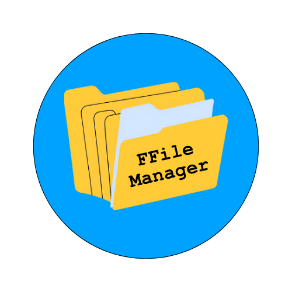

<p align="center"></p>

[](https://github.com/DBernardes/ffile_man/actions/workflows/python-package.yml)
[](https://ffile-man.readthedocs.io/en/latest/?badge=latest)
[](https://zenodo.org/doi/10.5281/zenodo.12763957)
[](https://semaphorep.github.io/codeastro/)

# Welcome to the FITS File Manager repository

The FITS File Manager (ffile_man) is a package developed to assist you in the management of large sets of image files. 
Using ffile_man, the data can be sorted into file groups, according to their purpose, like calibration and scientific data.
For that, ffile_man looks for the `DATE-OBS` and `OBSTYPE` keywords in the image header. 
The former is the timestamp in which the image was acquired and it is used to sort the images as a function of time. 
The latter is used to sort by the type of the observation.

In this article, we will give you the basics of how to start using ffile_man.


## Installing the package

Use the `pip` command to install the package into your local computer.

```bash
pip install ffile-man
```

## How to use this package

Once you have this package installed, you will be able to run the file `example.py` found in the root folder. For that, use the command below:

```{bash}
python example.py
```

This file contains three examples of how to use ffile_man. 
These examples use the set of FITS files present in the `./FITS` folder of this repository.
The first example will print all the files found in the folder.
The second will print the files with a timestamp greater than 2024-7-17T12:11:00 (isot).
The third will print the files whose `OBSTYPE` keyword matches the `FLAT` string.


## How to cite

Was this package useful for you? Think about citing us!

Following are two examples of how this package can be cited.


### Plain text

`Denis and Balaji-0-5, “FITS File Manager”. Zenodo, July 17, 2024. doi: 10.5281/zenodo.12763958.`


### Bibtex code
```
@software{denis_2024_12763958,
  author       = {Denis and
                  Balaji-0-5},
  title        = {FITS File Manager},
  month        = Jul,
  year         = 2024,
  publisher    = {Zenodo},
  version      = {v0.1.1},
  doi          = {10.5281/zenodo.12763958},
  url          = {https://doi.org/10.5281/zenodo.12763958}
}
```
